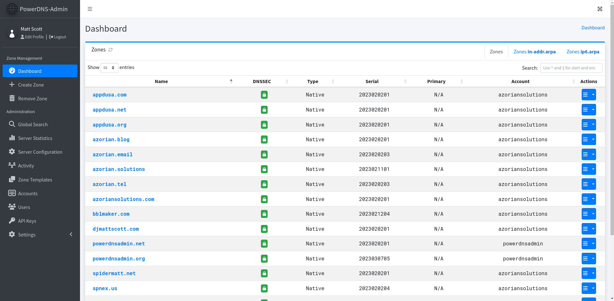

# PowerDNS-Admin

A PowerDNS web interface with advanced features.

[](https://github.com/PowerDNS-Admin/PowerDNS-Admin/actions/workflows/codeql-analysis.yml)
[](https://github.com/PowerDNS-Admin/PowerDNS-Admin/actions/workflows/build-and-publish.yml)

#### Features:

- Provides forward and reverse zone management
- Provides zone templating features
- Provides user management with role based access control
- Provides zone specific access control
- Provides activity logging
- Authentication:
  - Local User Support
  - SAML Support
  - LDAP Support: OpenLDAP / Active Directory
  - OAuth Support: Google / GitHub / Azure / OpenID
- Two-factor authentication support (TOTP)
- PDNS Service Configuration & Statistics Monitoring
- DynDNS 2 protocol support
- Easy IPv6 PTR record editing
- Provides an API for zone and record management among other features
- Provides full IDN/Punycode support

## [Project Update - PLEASE READ!!!](https://github.com/PowerDNS-Admin/PowerDNS-Admin/discussions/1708)

## Running PowerDNS-Admin

There are several ways to run PowerDNS-Admin. The quickest way is to use Docker.
If you are looking to install and run PowerDNS-Admin directly onto your system, check out
the [wiki](https://github.com/PowerDNS-Admin/PowerDNS-Admin/blob/master/docs/wiki/) for ways to do that.

### Docker

Here are two options to run PowerDNS-Admin using Docker.
To get started as quickly as possible, try option 1. If you want to make modifications to the configuration option 2 may
be cleaner.

#### Option 1: From Docker Hub

To run the application using the latest stable release on Docker Hub, run the following command:

```
$ docker run -d \
    -e SECRET_KEY='a-very-secret-key' \
    -v pda-data:/data \
    -p 9191:80 \
    powerdnsadmin/pda-legacy:latest
```

This creates a volume named `pda-data` to persist the default SQLite database with app configuration.

#### Option 2: Using docker-compose

1. Update the configuration   
   Edit the `docker-compose.yml` file to update the database connection string in `SQLALCHEMY_DATABASE_URI`.
   Other environment variables are mentioned in
   the [legal_envvars](https://github.com/PowerDNS-Admin/PowerDNS-Admin/blob/master/configs/docker_config.py#L5-L46).
   To use the Docker secrets feature it is possible to append `_FILE` to the environment variables and point to a file
   with the values stored in it.   
   Make sure to set the environment variable `SECRET_KEY` to a long random
   string (https://flask.palletsprojects.com/en/1.1.x/config/#SECRET_KEY)

2. Start docker container
   ```
   $ docker-compose up
   ```

You can then access PowerDNS-Admin by pointing your browser to http://localhost:9191.

## Screenshots



## Support

**Looking for help?** Try taking a look at the project's
[Support Guide](https://github.com/PowerDNS-Admin/PowerDNS-Admin/blob/master/.github/SUPPORT.md) or joining
our [Discord Server](https://discord.powerdnsadmin.org).

## Security Policy

Please see our [Security Policy](https://github.com/PowerDNS-Admin/PowerDNS-Admin/blob/master/SECURITY.md).

## Contributing

Please see our [Contribution Guide](https://github.com/PowerDNS-Admin/PowerDNS-Admin/blob/master/docs/CONTRIBUTING.md).

## Code of Conduct

Please see our [Code of Conduct Policy](https://github.com/PowerDNS-Admin/PowerDNS-Admin/blob/master/docs/CODE_OF_CONDUCT.md).

## License

This project is released under the MIT license. For additional
information, [see the full license](https://github.com/PowerDNS-Admin/PowerDNS-Admin/blob/master/LICENSE).

## [Donate](https://www.buymeacoffee.com/AzorianMatt)

Like my work?

<a href="https://www.buymeacoffee.com/AzorianMatt" target="_blank"></a>

**Want to sponsor me?** Please visit my organization's [sponsorship page](https://github.com/sponsors/AzorianSolutions).
