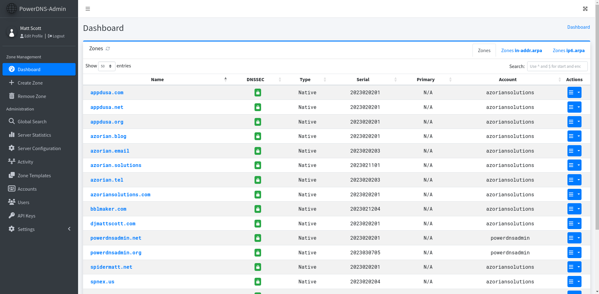

# PowerDNS-Admin

A web interface for PowerDNS with advanced features.

#### The following badges are for the dev branch

[](https://github.com/PowerDNS-Admin/PowerDNS-Admin/actions/workflows/codeql-analysis.yml)
[](https://github.com/PowerDNS-Admin/PowerDNS-Admin/actions/workflows/build-and-publish.yml)

## Features

-   Forward and reverse zone management
-   Zone templating
-   User management with role-based access control
-   Zone-specific access control
-   Activity logging
-   Authentication:
    -   Local users
    -   SAML
    -   LDAP (OpenLDAP / Active Directory)
    -   OAuth (Google / GitHub / Azure / OpenID)
-   Two-factor authentication (TOTP)
-   PDNS service configuration and statistics monitoring
-   DynDNS 2 protocol support
-   Easy IPv6 PTR record editing
-   API for zone and record management
-   Full IDN/Punycode support

## Compatibility

PowerDNS-Admin is built and tested against the current stable release of
the PowerDNS Authoritative Server, plus recent prior minor releases.
Support for versions older than 5.0 has been dropped entirely, even where
PowerDNS itself continues to backport critical/security fixes to them.
See
[`app-support.json`](https://github.com/PowerDNS-Admin/PowerDNS-Admin/blob/master/app-support.json)
for the exact PowerDNS, Python, and browser versions supported by the
current release.

## Running PowerDNS-Admin

The quickest way to run PowerDNS-Admin is with Docker. For instructions on installing PowerDNS-Admin directly on your system, please refer to our [wiki](https://github.com/PowerDNS-Admin/PowerDNS-Admin/blob/master/docs/wiki/).

### Docker

We offer two options for running PowerDNS-Admin with Docker.

#### Option 1: From Docker Hub

This option is ideal for getting started quickly. To run the latest stable release from Docker Hub, execute the following command:

```
$ docker run -d \
    -e SECRET_KEY='a-very-secret-key' \
    -v pda-data:/data \
    -p 9191:80 \
    powerdnsadmin/pda-legacy:latest
```

This command creates a volume named `pda-data` to persist the application's SQLite database.

**Note on image name:** While the image is named `pda-legacy`, it is the current and actively maintained version. The name is a historical artifact.

#### Option 2: Using docker-compose

This option is recommended if you need to customize the configuration.

1.  **Update the configuration**

    Edit the `docker/docker-compose.yml` file to set the `SQLALCHEMY_DATABASE_URI`. You can find a list of other environment variables in the [AppSettings.defaults](https://github.com/PowerDNS-Admin/PowerDNS-Admin/blob/master/powerdnsadmin/lib/settings.py) file.

    To use Docker-style secrets, you can append `_FILE` to an environment variable with a path to a file containing the secret (e.g., `SQLALCHEMY_DATABASE_URI_FILE=/run/secrets/db_uri`).

    Ensure you set the `SECRET_KEY` environment variable to a long, random string. For more information, please see the [Flask documentation](https://flask.palletsprojects.com/en/1.1.x/config/#SECRET_KEY).

2.  **Start the container**

    ```
    # From the root of the project
    $ docker-compose -f docker/docker-compose.yml up
    ```

You can now access PowerDNS-Admin in your browser at http://localhost:9191.

## Screenshots



## Support

For assistance, please see our [Support Guide](https://github.com/PowerDNS-Admin/PowerDNS-Admin/blob/master/.github/SUPPORT.md) or join our [Discord Server](https://discord.powerdnsadmin.org).

## Security

Please refer to our [Security Policy](https://github.com/PowerDNS-Admin/PowerDNS-Admin/blob/master/SECURITY.md) for information on reporting security vulnerabilities.

## Contributing

We welcome contributions to PowerDNS-Admin. Please see our [Contribution Guide](https://github.com/PowerDNS-Admin/PowerDNS-Admin/blob/master/docs/CONTRIBUTING.md) for more information.

## Code of Conduct

We are committed to providing a welcoming and inclusive environment for everyone. Please review our [Code of Conduct](https://github.com/PowerDNS-Admin/PowerDNS-Admin/blob/master/docs/CODE_OF_CONDUCT.md) for our community standards.

## License

PowerDNS-Admin is released under the MIT License. For more information, please see the [full license](https://github.com/PowerDNS-Admin/PowerDNS-Admin/blob/master/LICENSE).
