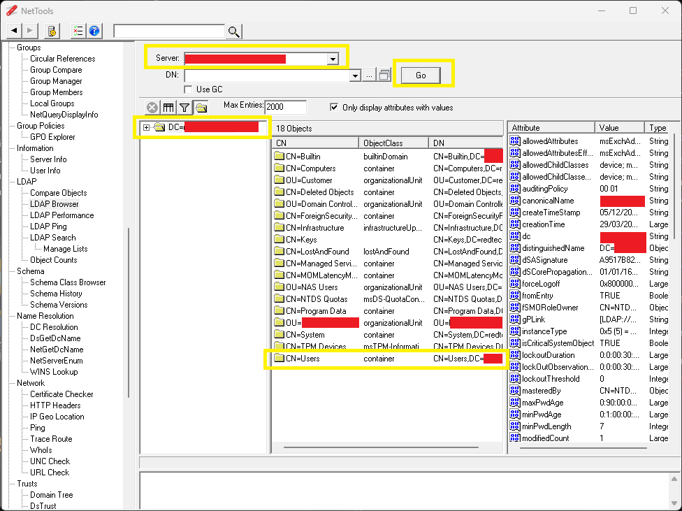
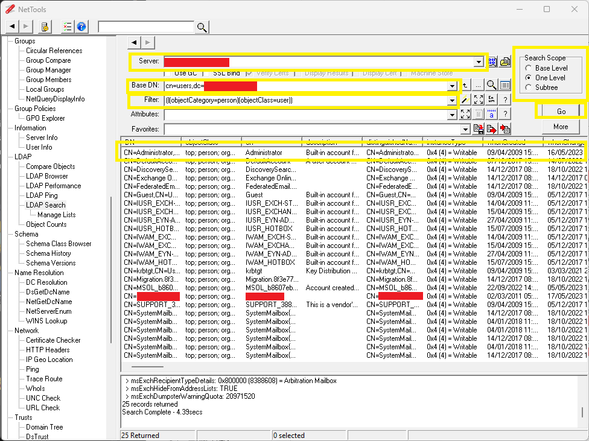

# PowerDNS-Admin Open LDAP/Active Directory integration

**Optional:** Firstly, you may want to create three new groups in your directory, one each for regular users, power users and administration users. With these groups in your directory, you can control PowerDNS-Admin access from your directory. Administration users can manage everything in PowerDNS-Admin (including authentication), power users can create and remove domains, and regular users can just add and remove domain records.

**When adding any other authentication, it is recommended to leave the local authentication enabled until you have confirmed that it is working.**

This will only allow you to configure a single LDAP/AD source for authentication. For multiple directory authentication or custom user databases, you need to setup a federated SSO/OIDC (for example, Keycloak or Authelia).

## OpenLDAP

As well as connecting to OpenLDAP, this method can be used to connect to Microsoft Active Directory servers as an alternative to the AD option below.

If you do not know your directory structure very well, you may need an LDAP browser, such as https://nettools.net/ldap-browser/, other browsers are available.

* LDAP URI

  This is the LDAP connection string to your server. It can be an IP address, or a domain name, and will look similar to `ldap://192.168.149.5:3268`. You may not need to specify the port number, but depending on your setup, port numbers could be one of 389 (non-SSL), 636 (SSL), 1636, 3268. See also https://ldap.com/ldap-urls/.

* LDAP Base DN

  This should be the base location for your users, and should look similar to `OU=users,OU=companyname,DC=example,DC=org`. If you do not know this, you can use the Nettools. Find the "LDAP/LDAP Browser" section in the tree, and just enter the server domain name or IP address in the "Server" box and click "Go". After a minute, it should return with a list of OUs, and allow you to find the users CN.
  
  

* LDAP admin username

  This is the LDAP path to your LDAP/AD administrator, and should look similar to `CN=administrator,OU=users,OU=companyname,DC=example,DC=org`. Using Nettools, find the "LDAP/LDAP Search" in the tree, and fill in the server and Base DN, select the "One Level" radio box, then click Go. In the list below, find your administrator user.
  
  

* LDAP admin password

  The LDAP/AD administrator password, as is, in plain text.

* Basic filter

  This is to weed out anything that is not a user. The "ObjectCategory" and "ObjectClass" are visible in the Nettools display for the admin username. You can perfect this string in Nettools so that all you see is just users. For Active directory, it will look similar to `(&(objectCategory=person)(objectClass=user))`.
  
  This will restrict the search to all objects that are in the category "person" and have a class of "user". See also: http://www.ldapexplorer.com/en/manual/109010000-ldap-filter-syntax.htm

* Username field

  In the same output of users as above in Nettools, you can select a field that contains the username. Normally for AD, this will be `sAMAccountName` to make the login the same as Windows and/or other systems, or you could use an email column or any other column that is unique.

* Group filter

  For AD, in most cases, this will be `(objectClass=group)`. See also https://support.jumpcloud.com/support/s/article/filtering-by-user-or-group-in-ldap-search-filters1.

* Group name field

  For AD, in most cases, this will be `member`. See also https://support.jumpcloud.com/support/s/article/filtering-by-user-or-group-in-ldap-search-filters1

**Optional:** If you would like to have multiple users with different permissions, complete the the following:

* Group security: On

* The three groups:
  - Admin group
  - Operator group
  - User group

  As with the "Username" or "Group filter" optiona above, use Nettools to find the relevant groups and enter the strings in the relevant boxes. All three boxes must be filled, and the hierarchy is Admin, Operator then User. The string is similar to `CN=PowerDNSAdmin,OU=groups,OU=company,DC=example,DC=org`.

**Optional:** Advanced options:
* Roles Autoprovisioning: Off
* Roles provisioning field: 
* Urn prefix: 
* Purge Rolws If Empty: On

## Active Directory

When it comes to Active Directory, the same details apply as for LDAP, however some fields are not required and some new fields are.

* Active Directory Domain

  This is a text string containing your AD domain name, similar to `example.org`.

