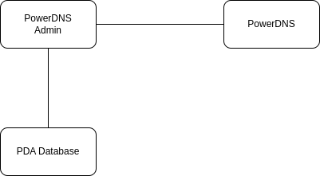

# General installation 

## PowerDNS-Admin Architecture

A PowerDNS-Admin installation includes four main components:
- PowerDNS-Admin Database
- PowerDNS-Admin Application Server
- PowerDNS-Admin Frontend Web server
- PowerDNS server that 

All 3 components can be installed on one server or if your installation is large enough or for security reasons can be split across multiple servers.

## Requirements for PowerDNS-Admin:
- A linux based system. Others (Arch-based for example) may work but are currently not tested.
  - Ubuntu versions tested:
    - To fill in
  - Red hat versions tested:
    - To fill in
  - Python versions tested:
    - 3.6
    - 3.7
    - 3.8
    - 3.9
    - 3.10
    - 3.11 - Failing due to issue with python3-saml later than 1.12.0
- A database for PowerDNS-Admin, if you are using a database for PowerDNS itself this must be separate to that database. The currently supported databases are:
  - MySQL
  - PostgreSQL
  - SQLite
- A PowerDNS server that PowerDNS-Admin will manage.
