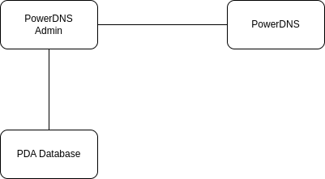

# General installation

## PowerDNS-Admin Architecture

A PowerDNS-Admin installation includes four main components:

- PowerDNS-Admin Database
- PowerDNS-Admin Application Server
- PowerDNS-Admin Frontend Web server
- PowerDNS server

All four components can be installed on one server. For larger installations or
security isolation, they can instead be split across multiple servers.

## Requirements for PowerDNS-Admin:

- A linux based system. Others (Arch-based for example) may work but are currently not tested.
  - Ubuntu versions tested:
    - To fill in
  - Red hat versions tested:
    - To fill in
  - Supported Python versions:
    - 3.10
    - 3.11
    - 3.12
    - 3.13
  - Python 3.9 and earlier are not supported by the current application
    dependencies.
  - Python 3.14 and later are not yet tested or supported.
- A database for PowerDNS-Admin, if you are using a database for PowerDNS itself this must be separate to that database. The currently supported databases are:
  - MySQL
  - PostgreSQL
  - SQLite
- A PowerDNS server that PowerDNS-Admin will manage.
